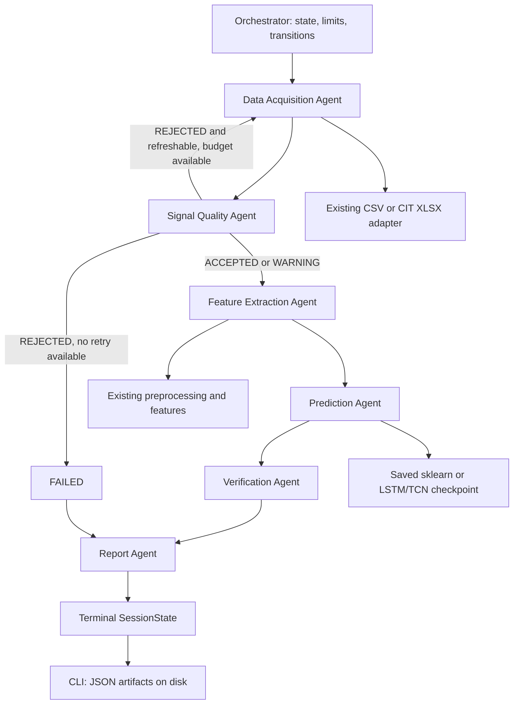

# Многоагентный слой анализа айтрекинга

Задача вне диссертационного плана, реализованная 2026-10-06. Это модульный
Python monolith с детерминированным Orchestrator и шестью агентами. LLM не
выбирает класс. Научное предсказание выдаёт сохранённая модель проекта.
Успешный workflow означает завершённое выполнение, а не доказанную научную
достоверность или заключение о правдивости человека.

## Что найдено и переиспользовано

В репозитории нет backend/API, frontend, БД или LangGraph. Поэтому вход — CLI,
состояние — в памяти одного запуска, хранение — JSON в новом output-каталоге.
Новых зависимостей нет. Используются существующие pandas/NumPy, scikit-learn,
PyYAML и опциональный PyTorch. Контракты — dataclasses с валидацией; проект
не использует Pydantic.

| Область | Integration point |
|---|---|
| CSV/XLSX | `TabularEyeTrackingAdapter`, `CITAdapter` в `src/data/adapters.py` |
| Обработка | `preprocess_eye_tracking` в `src/features/preprocessing.py` |
| Агрегаты | `create_aggregated_features` в `src/features/aggregated.py` |
| Baseline | Checkpoint `{model, feature_columns}` существующего `train_baseline_pipeline` |
| LSTM/TCN | `build_sequence_model`, state_dict существующего `train_sequence_pipeline` |
| Logging | Существующий `get_logger` плюс `ExecutionJournal` |
| Tests/config | pytest/Ruff, YAML, Python 3.10+ conventions |

Два реальных внешних ресурса workflow — файл записи CSV/XLSX и сохранённый
checkpoint ML-модели. Они читаются с диска, без искусственного сетевого API.
Synthetic source/model создаются только явно запускаемым примером в `examples/`
или тестами; production workflow никогда не генерирует замену отсутствующим данным.

Добавлены совместимые параметры `for_inference=False` у чтения/нормализации
и `include_labels=True` у агрегации. Старые вызовы сохраняют поведение.
В новом пути `label` удаляется до dataset hook, fallback класса не вызывается,
агрегаты не требуют и не возвращают labels. Старые обучающие fallback остаются
известным ограничением; эта задача не изменяет протокол обучения.

## Роли, контракты и инструменты

| Agent | Role | Input | Output | Tools | Completion Criterion |
|---|---|---|---|---|---|
| Orchestrator | Переходы, лимиты, retries, завершение | SessionRequest, config, agents | SessionState | Нет; вызывает интерфейс агентов | Терминальный COMPLETED/FAILED |
| DataAcquisitionAgent | Получить одно ограниченное испытание | SessionRequest | EyeTrackingWindow | `source.acquire` | Типизированные samples, совпадающие IDs |
| SignalQualityAgent | Проверить сигнал до preprocessing | EyeTrackingWindow | QualityReport | `quality.assess` | ACCEPTED/WARNING/REJECTED с причинами |
| FeatureExtractionAgent | Запустить существующий pipeline | EyeTrackingWindow, ModelSpec | FeatureVector | `features.preprocess`, `features.extract` | Конечные признаки правильной размерности |
| PredictionAgent | Применить сохранённую модель | FeatureVector, ModelSpec | PredictionResult | `model.predict` | Класс из контракта, реальные outputs модели |
| VerificationAgent | Применить инженерную политику | QualityReport, PredictionResult, errors | VerificationResult | `verification.verify` | ACCEPTED/INCONCLUSIVE/REJECTED |
| ReportAgent | Собрать результат | SessionState | SessionReport | `report.build` | Структурированный отчёт, без inference |

У агента максимум два tools; контекст запрещает незарегистрированный tool и
регистрацию более пяти tools. Общий `BaseAgent.execute` принимает `AgentTask`
и возвращает проверенный `AgentResult`; payload должен соответствовать этапу.
Между агентами нет нетипизированных словарей. pandas DataFrame остаётся
внутри feature service; словари используются для уже существующей конфигурации
ML и JSON-сериализации, не как сообщения между агентами.



Workflow: DATA_ACQUISITION → QUALITY_CHECK → FEATURE_EXTRACTION → PREDICTION
→ VERIFICATION → REPORT → COMPLETED. Ошибка этапа ведёт к FAILED и REPORT;
необработанный exception inference не выходит из workflow.
COMPLETED совместим с INCONCLUSIVE: система выполнила анализ, но проверка
не дала оснований принять решение.

## Границы и научная интерпретация

Один запуск — одно окно/испытание одного участника и сессии. Выбор осуществляется
по явным participant/trial/session IDs. Если CSV содержит question_id или
statement_id, их также нужно явно передать. Разорванные фрагменты одинакового
trial_id и смесь stimulus/statement/session отклоняются. Если session_id в CSV
отсутствует, CLI ID является **декларацией пользователя**, что файл относится к
одной сессии; восстановить неизвестные физические границы невозможно.
CIT inference требует уже указанные participant_id/trial_id: guess из имени
файла и stimulus-based trial fallback не используются в новом пути. Existing
left/right validity conventions адаптера сохраняются и требуют отдельного аудита.

Для baseline используется полное выбранное испытание. Для LSTM/TCN размер после
preprocessing должен точно совпадать с `window_size`; автоматическое обрезание
или перенос отсчётов из соседнего trial запрещены. Sequence service передаёт
имеющуюся label-free матрицу в существующую модель; обучающий window generator,
который требует labels, здесь не нужен.

Смысл класса задаёт контракт `class_meanings`, target — `truth_lie`, `cit` или
`synthetic_debug`. CIT не считается truth/lie. Нет встроенного предположения,
что класс 1 означает ложь. Для sklearn сохраняется `predict` и при наличии
`predict_proba`; для sequence — softmax logits, как в существующей оценке.
Confidence — output модели для предсказанного класса, а не измеренная надёжность
и не калиброванная вероятность. Для predict-only модели probability/confidence
равны null, verification — INCONCLUSIVE. Accuracy/F1/AUC в session report не
создаются: инференс не имеет ground truth.

Существующая обработка остаётся **офлайн**: интерполяция, нормализация и baseline
могут использовать всё выбранное окно. Агентный слой не доказывает причинность,
chunk-invariance или physical live. В отчёте отдельно указаны время накопления
по timestamp и время model service (включая чтение/проверку/загрузку checkpoint).
Статистику вызовов нельзя интерпретировать как долю CPU или независимые наблюдения.

## Конфигурация и качество

Файл [multi_agent.yaml](../configs/multi_agent.yaml) содержит инженерные
значения, не подобранные на scientific validation data:

| Setting | Default | Значение |
|---|---|---|
| max_workflow_steps | 16 | Максимум вызовов специализированных агентов, включая retries и report |
| max_retries | 2 | Дополнительные acquisition attempts; максимум три попытки |
| deadline_seconds | 60 | Кооперативный дедлайн workflow |
| min_samples | 16 | Минимум валидных samples до preprocessing |
| max_missing_ratio | 0.2 | Максимальная доля missing/invalid samples |
| validity_min | 0.5 | Совпадает с текущими training configs; при наличии validity |
| tracking_confidence_min | null | Опциональный минимум confidence источника, не confidence модели |
| sampling_jitter_warning | 0.2 | Порог std(dt)/median(dt) и относительного отклонения частоты |
| expected_sampling_hz | null | Ожидаемая частота, если известна из протокола |
| gaze_bounds | null | `[xmin, xmax, ymin, ymax]`, только по известной системе координат |
| pupil_bounds | null | `[min, max]` в единицах экспорта |
| min_model_confidence | null | Без утверждённого порога verification остаётся INCONCLUSIVE |

Quality score — наблюдаемая доля валидных строк, missing_ratio — её дополнение,
включая отсутствующие и недопустимые значения. Для baseline обязательны timestamp,
gaze_x/gaze_y/pupil; для sequence — timestamp и каналы модели. Проверяются
finite values, положительный pupil, validity/confidence в ожидаемой шкале,
опциональные физические bounds, количество samples, порядок timestamp и sampling.
Недоступные параметры перечислены в `unavailable_checks`. Универсальные screen
bounds и физический верхний предел pupil не выдумываются. Это простые проверки
выбросов по bounds; полноценного научного outlier/event detector здесь нет.
Маска ошибок видна через качество до preprocessing; существующий extractor
сохраняет свои правила fillna и эвристик, в том числе `fixation_count_estimate`.

WARNING качества, recovered errors, отсутствующий confidence или неуказанный
порог модели приводят к INCONCLUSIVE. ACCEPTED означает прохождение выбранных
инженерных проверок. Ни один default не утверждает научную достоверность.

## Retry, исключения и дедлайн

Только acquisition с явно recoverable `StageFailure` повторяется при ошибке.
Файловые transient ошибки EAGAIN/EINTR/ETIMEDOUT отмечаются recoverable;
отсутствующий файл, permission, ошибка схемы, extraction или модели — terminal.
Quality REJECTED возвращает управление acquisition только если source объявляет
`can_refresh=True`. Неизменяемый файл имеет `can_refresh=False`: перечитывание
того же плохого сигнала не создаёт новые данные.

Цикл ограничен `range(max_workflow_steps)`. Один шаг резервируется для report:
при слишком маленьком бюджете workflow завершается MAX_WORKFLOW_STEPS с отчётом.
Дедлайн проверяется до/после каждого синхронного tool, поздний результат
отбрасывается. Это **не hard timeout**: зависший Python/native вызов не прерывается,
для физического/сетевого SDK нужны собственные I/O timeouts. Финальный report
разрешён после дедлайна. При ошибке самого report статус FAILED, report отсутствует,
состояние и журнал сохраняются; бесконечного повторения нет.

## Logging и распределение вызовов

`ExecutionJournal` пишет STARTED и завершение каждого agent/tool: случайный run ID,
имя, step, retry_attempt, UTC start/finish, duration_ms, status и safe error code.
Логи не содержат аргументов tools, samples, participant/session IDs, путей записей
и exception messages. В `SessionReport` сохраняются исследовательские IDs и
агрегаты; артефакты предназначены для разрешённого локального исследования,
а не автоматической публикации. State JSON исключает raw_data.

Форма записи (duration и run ID меняются):

```json
{"run_id":"generated-uuid","kind":"tool","agent_name":"PredictionAgent",
 "tool":"model.predict","step":"PREDICTION","retry_attempt":0,
 "start_time":"UTC ISO8601","finish_time":"UTC ISO8601","duration_ms":12.3,
 "status":"SUCCESS","error":null,"tools_called":[]}
```

Статистика конкретного запуска: `workflow.journal.statistics()`;
CLI сохраняет `agent-stats.json`. Реальный успешный путь делает 14 вызовов:

| Agent | agent_calls | tool_calls | total_calls | percentage |
|---|---:|---:|---:|---:|
| Orchestrator | 1 | 0 | 1 | 7.14% |
| DataAcquisitionAgent | 1 | 1 | 2 | 14.29% |
| SignalQualityAgent | 1 | 1 | 2 | 14.29% |
| FeatureExtractionAgent | 1 | 2 | 3 | 21.43% |
| PredictionAgent | 1 | 1 | 2 | 14.29% |
| VerificationAgent | 1 | 1 | 2 | 14.29% |
| ReportAgent | 1 | 1 | 2 | 14.29% |

Максимум 21.43%, ниже 40%, без фиктивных вызовов. Ошибки/retries меняют доли;
ограничение 40% проверяется для типового успешного workflow.

## Запуск

Из корня репозитория в текущем окружении, без новой установки:

```powershell
.venv/Scripts/python.exe examples/multi_agent_demo.py
```

Пример явно создаёт synthetic training/test fixture, обучает существующий
baseline **вне агентов**, выбирает trial из test participants и запускает
workflow без labels. Новый каталог `outputs/agent-demo-<UUID>/` содержит
training outputs, split manifest, model spec, example provenance и `workflow/`.
Synthetic метрики — проверка выполнения, не научный результат. Default
verification — INCONCLUSIVE. Повторный запуск создаёт новый каталог.

Для наглядного показа добавьте `--open` (или `--present` без открытия браузера).
Будут реально выполнены ещё два controlled failure scenarios: плохой synthetic
сигнал и неверный model checksum. Полученный `presentation.html` содержит
схему, пошаговую анимацию сохранённых agent executions, результаты, журнал и
диаграмму вызовов. Это portable offline viewer, не новый live/backend.
Порядок показа: [DEMO_GUIDE_RU.md](DEMO_GUIDE_RU.md).

Для реальной разрешённой записи и уже обученной доверенной модели:

```powershell
.venv/Scripts/python.exe -m src.agents.cli --source data/processed/session.csv --model-spec outputs/model-spec.json --trusted-model --session-id session-01 --participant-id p01 --trial-id trial-01 --timestamp-unit ms
```

При CIT XLSX добавить `--source-format cit-xlsx`; при соответствующих полях —
`--question-id`/`--statement-id`. `--config` выбирает YAML policy;
`--output-dir` должен указывать новый каталог. После установки пакета также
доступен `eye-agent-workflow` с теми же аргументами. Коды выхода: 0 COMPLETED,
1 workflow FAILED, 2 неверный setup/существующий output. Артефакты:
`state.json`, `report.json`, `logs.json`, `agent-stats.json`, `provenance.json`.
Provenance сохраняет config, model contract/hash, source hash, версии;
seed/split для inference равны null, поскольку обучение здесь не выполняется.

Контракт baseline, JSON (заменить hash, target и meanings по своему эксперименту):

```json
{
  "family": "baseline",
  "checkpoint": "checkpoints/logistic_regression.pkl",
  "checkpoint_sha256": "<64 lowercase hex characters>",
  "model_version": "experiment-run-and-checkpoint-version",
  "target": "cit",
  "class_meanings": {"0": "protocol-defined control", "1": "protocol-defined target"},
  "timestamp_unit": "ms",
  "preprocessing": {
    "mode": "offline", "sort_by_timestamp": true, "validity_min": 0.5,
    "interpolate": true, "interpolation_limit": 5,
    "smoothing": {"method": "rolling_mean", "window": 5},
    "normalization": {"kind": null},
    "pupil_baseline": {"enabled": true, "fraction": 0.1}
  }
}
```

Checkpoint path относителен к spec JSON. Class order должен совпадать с
`model.classes_`, feature order берётся из существующего checkpoint.
Preprocessing/units должны совпадать с обучением: старый checkpoint этого не
содержит и автоматически подтвердить такую декларацию невозможно. SHA256
фиксирует файл, но не делает pickle безопасным; `--trusted-model` — явное
подтверждение доверенного происхождения, не проверка безопасности.

Sequence spec дополнительно содержит `family: "sequence"`, `sequence_columns`,
`window_size`, `architecture` с существующими `name`, `input_dim`, `hidden_dim`,
`num_layers`, `dropout`, `num_classes`. Пример architecture:
`{"name":"lstm","input_dim":4,"hidden_dim":8,"num_layers":1,"dropout":0.0,"num_classes":2}`.
Загрузка state_dict использует CPU и `weights_only=True`; `deep` extra должен
уже быть установлен. Автоматическое обучение внутри PredictionAgent запрещено.

## Проверки и оставшиеся ограничения

`tests/test_agents.py` проверяет полный existing baseline pipeline, низкую
уверенность, bad quality, recoverable acquisition, лимиты, deadline, model/feature
errors, typed contracts, privacy logs, статистику, границы, label independence,
predict-only model и CLI в новом процессе. `tests/test_agents_deep.py` обучает
маленькие synthetic LSTM/TCN через существующий pipeline и сверяет inference с
прямым вызовом сохранённой модели; также проверяет несовпадающий размер окна.

Физического устройства, SDK и сырых truth/lie рядов пока нет. Полный model bundle,
научные пороги/калибровка, causality/chunk tests, live/replay engine и независимые
научные эксперименты остаются задачами основного плана. Multi-agent слой их не
подменяет. Новые тесты проверяют инженерное выполнение на synthetic fixtures.
Текущие результаты проверок фиксируются в [WORK_STATUS](WORK_STATUS.md).
